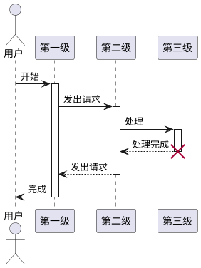
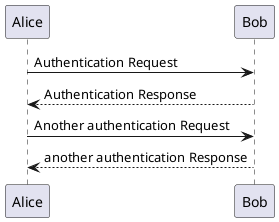
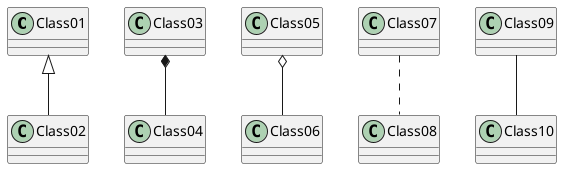
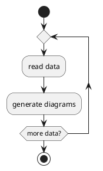
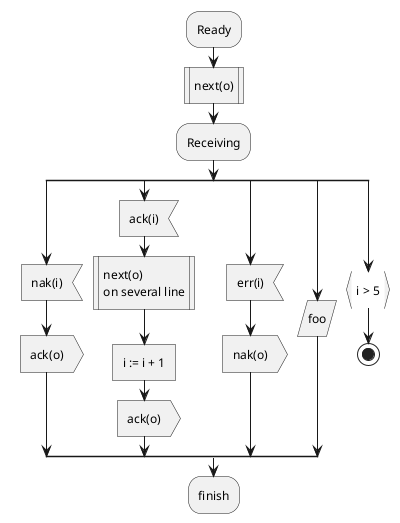
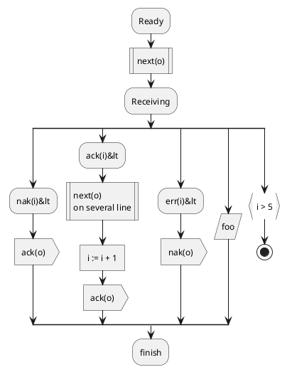
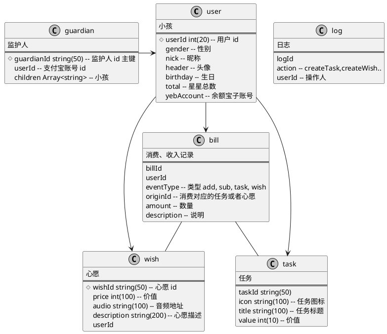
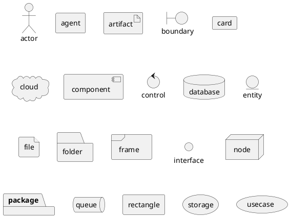

# Markdown 语法：PlantUML 图

云雀通过集团的[服务](https://puml.alipay.com/)，支持 [PlantUML](http://plantuml.com/) 图。

下面是一些例子。




<pre>

</pre>



<pre>
```plantuml
@startuml
Alice -> Bob: Authentication Request
Bob --> Alice: Authentication Response

Alice -> Bob: Another authentication Request
Alice &lt;-- Bob: another authentication Response
@enduml
```
</pre>



<pre>
```plantuml
@startuml
Class01 &lt;|-- Class02
Class03 *-- Class04
Class05 o-- Class06
Class07 .. Class08
Class09 -- Class10
@enduml
```
</pre>



<pre>

</pre>



<pre>

</pre>



<pre>

</pre>




