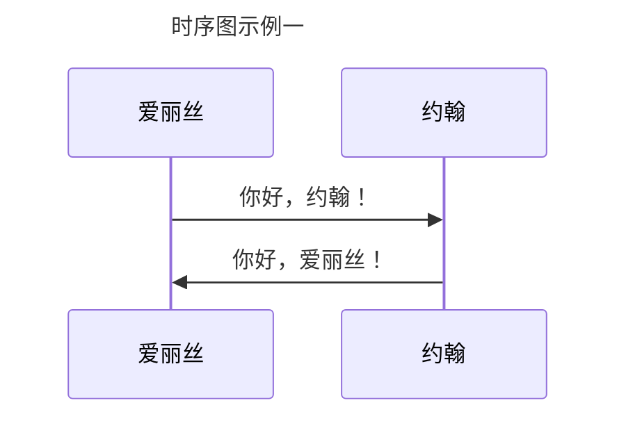
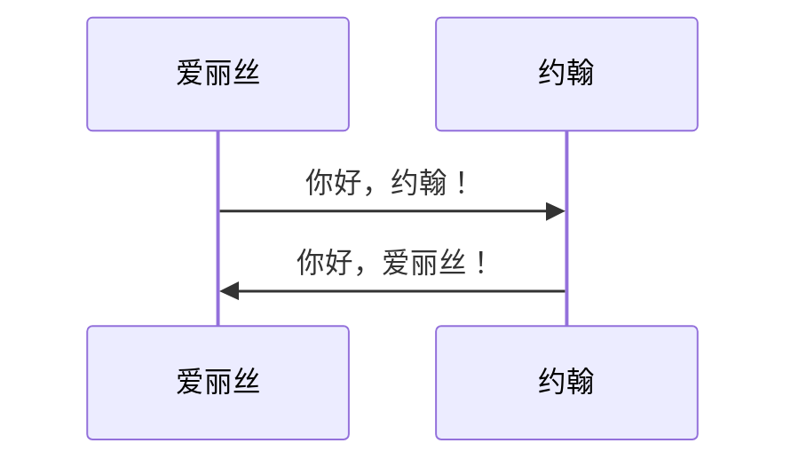
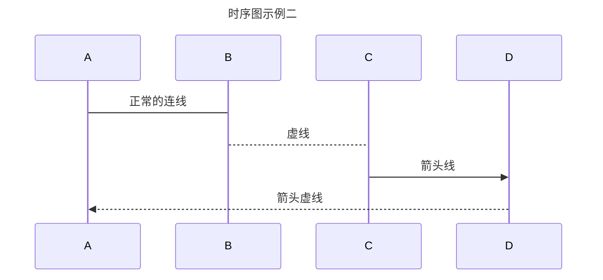

# Markdown 语法：时序图

云雀通过 [Mermaid](http://knsv.github.io/mermaid/) 库支持时序图（sequnence diagram）。

```mermaid
sequenceDiagram
    title: 时序图示例一
    爱丽丝->>约翰: 你好，约翰！
    约翰->>爱丽丝: 你好，爱丽丝！ 
```

<pre>

```mermaid
sequenceDiagram
    爱丽丝->>约翰: 你好，约翰！
    约翰->>爱丽丝: 你好，爱丽丝！ 
```
</pre>

```mermaid
sequenceDiagram
Title: 时序图示例二
	A->B: 正常的连线
	B-->C: 虚线
	C->>D: 箭头线
	D-->>A: 箭头虚线
```

<pre>

```mermaid
sequenceDiagram
Title: 时序图示例二
	A->B: 正常的连线
	B-->C: 虚线
	C->>D: 箭头线
	D-->>A: 箭头虚线
```
</pre>

