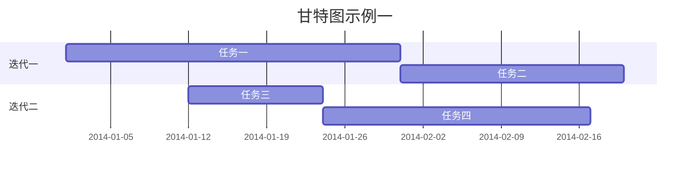
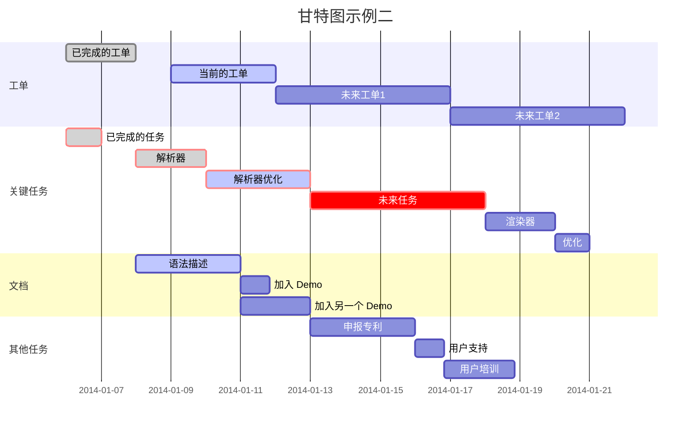

# Markdown 语法：甘特图

云雀通过 [Mermaid](https://github.com/knsv/mermaid) 库支持甘特图语法。

```mermaid
gantt
title 甘特图示例一

    section 迭代一
    任务一           :a1, 2014-01-01, 30d
    任务二     :after a1  ,  20d
    section 迭代二
    任务三      :2014-01-12  , 12d
    任务四      : 24d
```

<pre>

```mermaid
gantt
title 甘特图示例一

    section 迭代一
    任务一           :a1, 2014-01-01, 30d
    任务二     :after a1  ,  20d
    section 迭代二
    任务三      :2014-01-12  , 12d
    任务四      : 24d
```
</pre>

```mermaid
gantt
dateFormat  YYYY-MM-DD
title 甘特图示例二

section 工单
已完成的工单         :done,    des1, 2014-01-06,2014-01-08
当前的工单           :active,  des2, 2014-01-09, 3d
未来工单1            :         des3, after des2, 5d
未来工单2            :         des4, after des3, 5d

section 关键任务
已完成的任务 :crit, done, 2014-01-06,24h
解析器      :crit, done, after des1, 2d
解析器优化   :crit, active, 3d
未来任务    :crit, 5d
渲染器      :2d
优化       :1d

section 文档
语法描述     :active, a1, after des1, 3d
加入 Demo   :after a1  , 20h
加入另一个 Demo :doc1, after a1  , 48h

section 其他任务
申报专利    :after doc1, 3d
用户支持    :20h
用户培训    :48h
```

<pre>

```mermaid
gantt
dateFormat  YYYY-MM-DD
title 甘特图示例二

section 工单
已完成的工单         :done,    des1, 2014-01-06,2014-01-08
当前的工单           :active,  des2, 2014-01-09, 3d
未来工单1            :         des3, after des2, 5d
未来工单2            :         des4, after des3, 5d

section 关键任务
已完成的任务 :crit, done, 2014-01-06,24h
解析器      :crit, done, after des1, 2d
解析器优化   :crit, active, 3d
未来任务    :crit, 5d
渲染器      :2d
优化       :1d

section 文档
语法描述     :active, a1, after des1, 3d
加入 Demo   :after a1  , 20h
加入另一个 Demo :doc1, after a1  , 48h

section 其他任务
申报专利    :after doc1, 3d
用户支持    :20h
用户培训    :48h
```
</pre> 